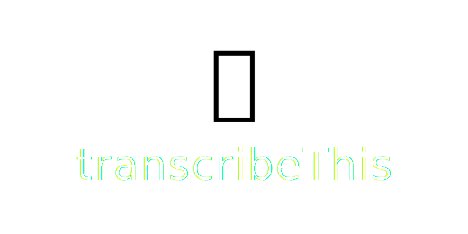
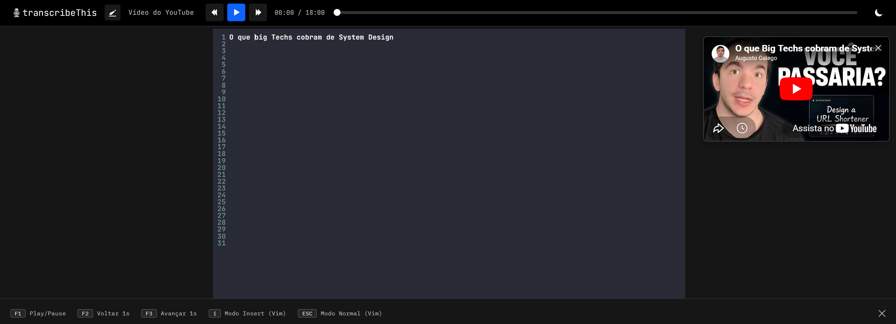

<p align="center">
  
</p>

Um aplicativo simples para transcrever áudios e vídeos manualmente — como uma
reunião, entrevista, aula ou podcast — direto na sua tela, sem precisar
alternar entre o player de mídia e um editor de texto separado.

## Para que serve

Você carrega um arquivo de áudio ou vídeo (ou cola um link do YouTube),
escreve o que está sendo dito em um editor de texto ao lado, e usa atalhos de
teclado para controlar a reprodução sem precisar tirar as mãos do teclado.
Tudo que você digita é salvo automaticamente, então não há risco de perder o
trabalho se a página for fechada por acidente.

Também é possível pedir para o próprio aplicativo transcrever o áudio
automaticamente usando Inteligência Artificial (Whisper, da OpenAI), caso você
prefira revisar um texto pronto em vez de digitar tudo do zero.

## 📋 Características

<p align="center">
	
</p>

- ✅ Suporte a arquivos de áudio e vídeo
- ✅ Controles de reprodução (Play/Pause, Voltar, Avançar)
- ✅ Barra de progresso interativa
- ✅ Atalhos de teclado personalizados
- ✅ Editor de texto com Vim bindings completo
- ✅ Tema claro e escuro
- ✅ Interface profissional com Carbon Design System da IBM
- ✅ Transcrição automática com Inteligência Artificial

## 🚀 Como Usar

1. Abra o aplicativo.
2. Clique em **"Selecionar Arquivo de Áudio/Vídeo"** e escolha o arquivo no
   seu computador (ou use a opção de carregar um vídeo do YouTube pelo link).
3. Use os botões de reprodução na tela, ou os atalhos de teclado abaixo, para
   controlar o áudio/vídeo enquanto digita.
4. Escreva sua transcrição no campo de texto — as alterações são salvas
   automaticamente, sem precisar clicar em nenhum botão de "salvar".
5. Quando terminar, exporte o texto (veja "Funcionalidades extras" abaixo).

## 🎹 Atalhos de Teclado

### Controle de reprodução

| Tecla | Ação |
|---|---|
| **F1** | Play / Pause |
| **F2** | Voltar 1 segundo |
| **F3** | Avançar 1 segundo |

### Edição de texto (modo Vim)

O campo de transcrição tem suporte completo aos comandos do editor **Vim**,
para quem já está acostumado com ele:

| Tecla | Ação |
|---|---|
| **i** | Entrar no modo de inserção (digitar texto) |
| **Esc** | Voltar ao modo normal |
| **h / j / k / l** | Navegar pelo texto |
| **dd** | Apagar a linha atual |
| **yy** | Copiar a linha atual |
| **p** | Colar |

Se você não conhece o Vim, não se preocupe: também é possível simplesmente
clicar no campo de texto e digitar normalmente.

## 💡 Funcionalidades Avançadas

### Tema claro/escuro

Clique no ícone de sol/lua no canto superior direito para alternar entre os
temas claro e escuro.

### Transcrição automática com IA 🤖

O aplicativo pode enviar o áudio para o serviço Whisper, da OpenAI, e
preencher o texto automaticamente. Para usar esse recurso, você precisa
informar sua própria chave de API da OpenAI (disponível em
[platform.openai.com/api-keys](https://platform.openai.com/api-keys)) nas
configurações do aplicativo. Sem essa chave, o aplicativo continua funcionando
normalmente — só o recurso de transcrição automática fica desativado.

### Exportar, ver estatísticas ou limpar a transcrição

Esses comandos ficam disponíveis no console de desenvolvedor do navegador
(tecla F12 → aba "Console"):

```javascript
exportTranscription()   // baixa sua transcrição como arquivo de texto
getStats()               // mostra estatísticas (nº de palavras, caracteres etc.)
clearTranscription()     // limpa todo o texto digitado
```

## 📝 Inspiração

Projeto inspirado no [oTranscribe](https://github.com/oTranscribe/oTranscribe), com melhorias e funcionalidades adicionais.

## Licença

Projeto de código aberto para uso educacional e pessoal.

## 🤝 Contribuições

Sugestões e melhorias são bem-vindas!
